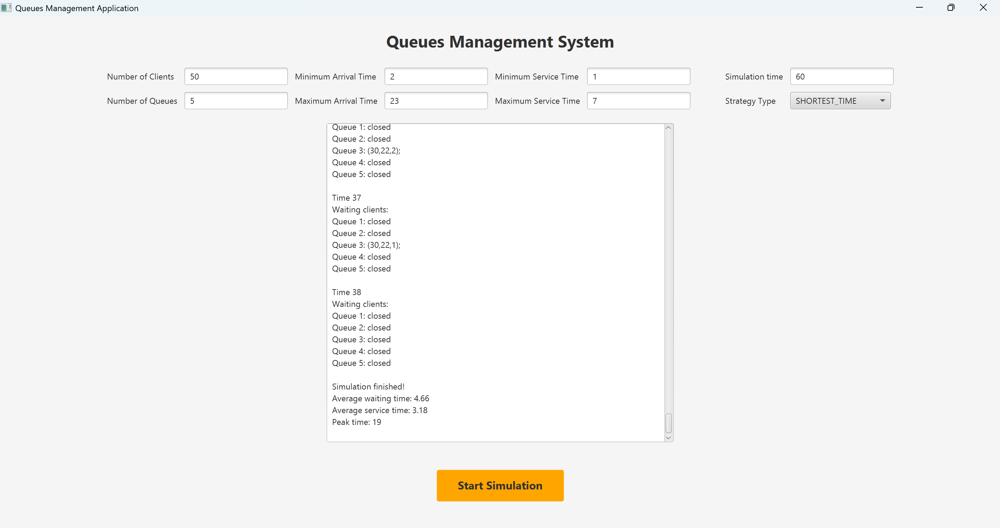

#  Queues Management Application (Java, OOP, JavaFX, Threads)

##  Overview
This project is a **Queues Management Application** built in Java for the **Fundamental Programming Techniques** course (2025, Technical University of Cluj-Napoca).  

It simulates a system where multiple clients arrive over time and are assigned to queues, each served by a dedicated thread. The application aims to **minimize waiting time** while maintaining efficiency.  

The system applies:  
- **Object-Oriented Programming principles**  
- **Multithreading** (one thread per queue + simulation thread)  
- **Synchronization mechanisms** for thread safety  
- **JavaFX GUI** for simulation control and visualization  
- **Logging** of all events in a `.txt` file  

---

##  Features
-  **Client Simulation**: Randomly generated clients with:  
  - ID  
  - Arrival time  
  - Service time  
-  **Queue Management**:  
  - Multiple queues processed in parallel threads  
  - Assign clients dynamically to minimize waiting time  
-  **Scheduling Strategies**:  
  - **Shortest Queue** → assigns to the queue with fewer clients  
  - **Shortest Time** → assigns to the queue with the lowest waiting time  
-  **Logging & Statistics**:  
  - Event log saved to `.txt`  
  - Average waiting time  
  - Average service time  
  - Peak time (time with maximum load)  
-  **GUI**: Configure parameters and watch the simulation in real time.  

---

##  Project Structure

### Core Classes
- **Task** → Represents a client with ID, arrival time, service time, and waiting time.  
- **Server** → Represents a queue; runs on its own thread, processing tasks sequentially.  
- **Scheduler** → Manages servers and dispatches tasks based on selected strategy.  
- **Strategy (interface)** → Defines assignment behavior.  
  - **ShortestQueueStrategy** → Assigns client to queue with least tasks.  
  - **TimeStrategy** → Assigns client to queue with shortest waiting period.  
- **SimulationManager** → Controls the simulation:  
  - Generates random clients  
  - Dispatches clients to queues  
  - Logs simulation progress and statistics  

### GUI (JavaFX)
The **JavaFX interface** allows the user to:  
- Set number of clients, queues, and simulation time  
- Configure arrival and service time ranges  
- Choose scheduling strategy (Shortest Queue / Shortest Time)  
- Run the simulation  

---

##  Tech Stack
- **Language**: Java (OOP, concurrency, synchronization)  
- **Concurrency**: Threads, BlockingQueue, AtomicInteger  
- **GUI**: JavaFX  
- **Logging**: File I/O 

---

## 📷 GUI Preview

Here is a screenshot of the application’s interface:

